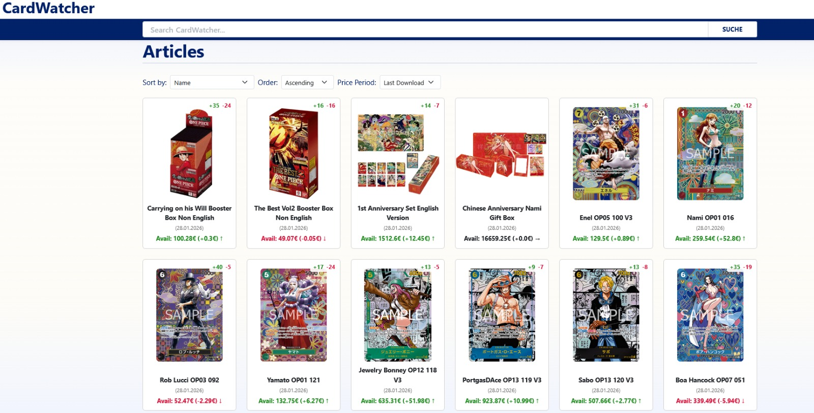
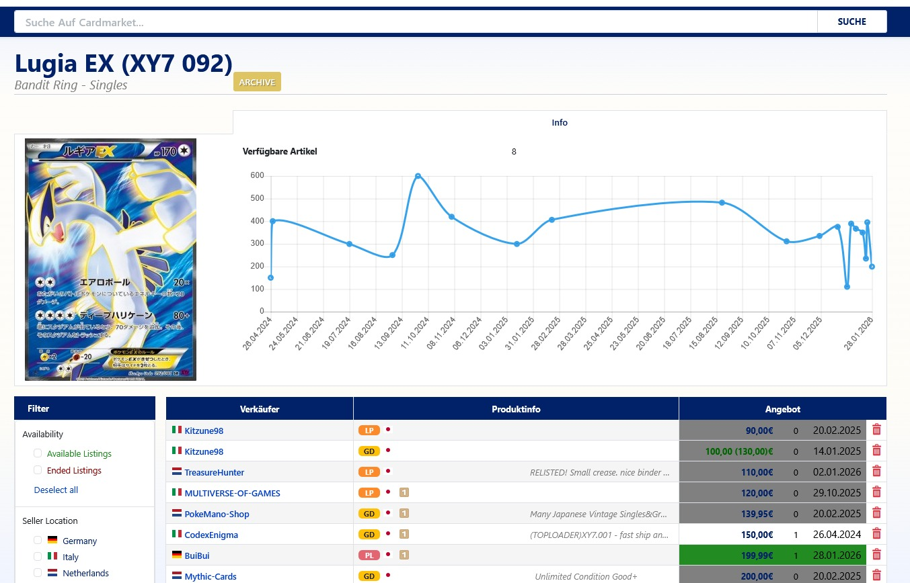

# CardWatcher

A Windows application for tracking CardMarket trading card listings over time. Monitor price changes, new listings, sold items, and manage your personal card collection.



## Features

- **Price Tracking**: Track average prices and price changes over time (1 week, 1 month, 2 months, 6 months)
- **Sold Price Tracking**: Monitor ended/sold listing prices separately from available listings
- **Lowest Price Display**: See the minimum price for each card at a glance
- **Price History Chart**: Quantity-weighted average price curve with IQR-based outlier filtering
- **Availability Chart**: Bar chart showing available stock (split into existing vs. newly listed) and sold quantities per day/week/month, with a drainage % overlay line
- **Market Metrics**: Net Supply Change (% of stock that is net new vs. sold) shown per card in the gallery, color-coded green (growing) / red (shrinking); sort by Net Supply Change, Drainage, or Inflation
- **Quantity History**: Full quantity-per-listing history tracked over time for accurate availability graphs, especially for bulk listings
- **Personal Collection**: Track cards you own with quantity, condition, and language - see your collection's total value
- **Data Sync**: Pull updates from shared data repository, optionally push your contributions back
- **Listing History**: See when listings were added, sold, or relisted
- **Search & Sort**: Search by card name, sort by price, price change, lowest price, or market metrics
- **Archive Support**: Archive cards you no longer want to actively track

## Quick Start (Windows)

### Option 1: Download Pre-built Executable

1. **Download the executable** from the dist folder
2. **Download the data repository**:
   ```bash
   git clone https://github.com/hanfffff/cardwatcher-data.git
   ```
3. **Run CardWatcher.exe**
   - On first run, you'll be prompted to select your data directory - point it to the `cardwatcher-data` folder
   - The application opens automatically in your default browser

That's it! Your browser will open automatically. If port 5000 is already in use, the app will automatically find an available port.

### Option 2: Run from Source

If you want to run from source or contribute to development:

1. **Clone both repositories:**
   ```bash
   git clone <this-repository-url>
   git clone https://github.com/hanfffff/cardwatcher-data.git
   ```

2. **Install Python 3.8+ and dependencies:**
   ```bash
   cd cardwatcher
   pip install -r requirements.txt
   ```

3. **Run the application:**
   ```bash
   python cardwatcher.py
   ```

**Command line options:**
```bash
python cardwatcher.py -p 8080       # Use different port
python cardwatcher.py --no-browser  # Don't auto-open browser
```

## Using CardWatcher

### Search View (Home Page)

- Browse all tracked cards as a gallery
- Use the search box to filter by card name
- Sort by: Name, Price, Price Change (€), Percentage Change (%), Lowest Price, Net Supply Change, Drainage, Inflation
- Select time period: Last Download, 1 Week, 1 Month, 2 Months, 6 Months
- Toggle between Available and Sold price types
- Each card badge (top-right) shows current stock count, listing changes (+added / −sold), and Net Supply Change %
  - Green % = supply growing (more new listings than sold)
  - Red % = supply shrinking (more sold than new listings)

### My Collection

Click the **My Collection** button to view only cards you own:
- See your collection's total value based on current market prices
- Sort by name or collection value
- Each card shows your quantity and calculated value

### Card Detail View



Click any card to see:
- All individual listings with seller info, prices, and conditions
- Price history per listing
- Color-coded rows: green = new, red = ended/sold, orange = quantity decreased, yellow-green = quantity increased
- Filter by country or language
- **Download button** to update this specific card
- **Archive** button to stop tracking
- **Price history chart**: quantity-weighted average with outlier filtering, shown for 1M / 3M / 6M / All periods
- **Availability chart**: stacked bar chart (blue = existing stock, green = newly listed, red = sold below zero) with a drainage % line; aggregates to weeks for ranges >1 month and to months for ranges >6 months

### Adding Cards to Your Collection

On any card's detail page:
1. Scroll to the "My Collection" section
2. Select quantity, language, condition, and any special attributes
3. Click "Add to Collection"

Your collection is stored privately on your computer and won't sync with others.

### Syncing Data

Use the sync buttons in the header:
- **Pull**: Download latest card data from the shared repository
- **Full Sync**: Pull updates AND push any cards you've downloaded locally (requires git credentials)

## Downloading New Card Data

CardMarket uses Cloudflare protection. Cards can be updated using the built-in downloader or manually.

### Automated Download

1. Click **Start Download** in the control bar
2. The browser opens minimized and downloads all tracked pages
3. Progress shows in real-time
4. Click **Stop** to cancel at any time

For a single card, click the **Download** button on its detail page.

### Manual Download

1. Open the CardMarket listing page in your browser
2. Click all "Show More" buttons to load all listings
3. Save the page (Ctrl+S) as "Webpage, Complete" into the `downloads/` folder inside your data directory
4. Refresh CardWatcher - it automatically imports new downloads

### Adding a New Card

To start tracking a card that isn't in the data repository:

1. Find the card on CardMarket
2. Click all "Show More" buttons to load all listings
3. Save the page (Ctrl+S) into the `downloads/` folder inside your data directory
4. Open CardWatcher - the card will be imported automatically

## Data Storage

- **Card data**: Stored in your selected data directory (`cardwatcher-data/`)
  - `pages/` - Active card tracking data
  - `archive/` - Archived cards
  - `images/` - Card images
  - `changes/` - Price history metrics
  - `downloads/` - Temporary folder for manually downloaded HTML files
- **Your collection**: Stored privately in your home directory (`~/.cardwatcher_collection.json`)
- **Settings**: Stored in your home directory (`~/.cardwatcher_settings.json`)

## Building the Executable

To build the Windows executable yourself:

```bash
pip install pyinstaller
pyinstaller cardwatcher.spec
```

The executable will be created in the `dist/` folder.

## Supported Games

CardWatcher can track cards from any game on CardMarket:
- Pokemon
- One Piece
- Yu-Gi-Oh!
- Magic: The Gathering
- And more...

## Troubleshooting

**"Address already in use" error:**
- Use a different port: `python cardwatcher.py -p 5001`

**Selenium downloader fails:**
- Ensure Chrome is installed and up-to-date
- The downloader will automatically restart if the browser crashes

**No listings showing:**
- Make sure "Show More" buttons were clicked before saving the page

## License

This project is for personal use. CardMarket's terms of service may apply to automated access.
