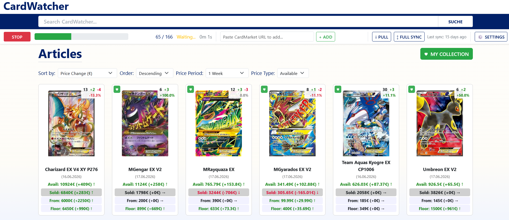

# CardWatcher

A Windows app for tracking CardMarket trading-card listings over time — price changes, new/sold listings, supply trends, and your personal collection.


## Features

- **Dashboard**: home-page overview — biggest price movers, biggest net supply losses, and pressure/divergence signals.
- **Market price**: one representative number per card (average condition, usual language) via **Floor**, **Sold**, and **Blend**, overlaid on the price chart and shown next to "From" in search.
- **Price & sold tracking**: available and ended/sold price averages with change over 1W / 1M / 2M / 6M.
- **From & Floor**: raw lowest and filtered buy-now price per card, each with its period change.
- **Price chart**: quantity-weighted average with IQR outlier filtering.
- **Availability chart**: existing vs. newly listed stock and sold quantities per day/week/month, with a drainage % line.
- **Supply metrics**: per-card Net Supply Change, Drainage, and Inflation; sort the gallery by any of them.
- **History**: per-listing quantity and add/sell/relist history tracked over time.
- **Collection**: track owned cards (quantity, condition, language) and see total value.
- **Automated downloads**: a background priority queue refreshes all cards while letting an individual **Download** jump the line; an optional daily auto-refresh keeps data current on its own.
- **Import & Sync page**: one place for the download queue, adding a card by URL, importing saved downloads, the download/import settings, daily auto-refresh, and data sync — reached from the **Import & Sync** button in the header.
- **Data sync**: pull shared data, optionally push your downloads back.
- **Search, sort & archive**: filter by name, sort by price/change/metric, archive cards you no longer track.
- **Dark mode**: a ☾ / ☀ toggle in the header switches the whole app between light and dark; your choice is remembered.

## Quick Start (Windows)

### Option 1: Pre-built executable

1. Download `CardWatcher.exe` from the `dist/` folder.
2. Clone the data repository:
   ```bash
   git clone https://github.com/hanfffff/cardwatcher-data.git
   ```
3. Run `CardWatcher.exe`. On first launch, point it at your `cardwatcher-data` folder.

The app opens in your browser automatically. If port 5000 is busy, it picks the next free one.

### Option 2: Run from source

```bash
git clone https://github.com/hanfffff/cardwatcher.git
git clone https://github.com/hanfffff/cardwatcher-data.git
cd cardwatcher
pip install -r requirements.txt
python cardwatcher.py
```

Options: `-p 8080` (port), `--no-browser` (don't auto-open).

### Running the tests

```bash
pip install -r requirements-dev.txt
python -m pytest
```

(`requirements-dev.txt` is kept separate from `requirements.txt` so test deps stay out of the packaged executable.)

## Using CardWatcher

### Dashboard (home page)

The home page summarises the most notable movements across all tracked cards in three panels:

- **Biggest price movers** — the top gainers and fallers ranked by their 1-week change in blended market price. Limited to cards with at least 10 available, so thin listings don't dominate.
- **Net supply loss** — cards whose available supply shrank the most over the past week, i.e. are being bought up faster than they are relisted. Again limited to cards that started the week with ≥10 available.
- **Pressure / divergence** — cards where the *price* move and the *supply* move disagree, which can be an early signal. Each card is bucketed as:
  - **Coiling** — supply has drained sharply but the price hasn't moved yet. The scarcity isn't priced in, so there may be upward pressure building.
  - **Overbought** — the price rose without supply shrinking. The move isn't backed by scarcity and may not hold.
  - **Cooling** — the price rose, but supply is *growing* (sellers piling in), which tends to cap or reverse the rise.

Use the search box or **Browse all cards** for the full gallery.

### Browse all cards



A sortable gallery of every tracked card. Each card shows **Avail**, **Sold**, **From**, and **Floor** prices (each with its change for the selected period) plus a stock badge with quantity, +added/−sold, and Net Supply Change % (green = growing, red = shrinking). Sort by name, price, price change, lowest price, or a supply metric, over Last Download / 1W / 1M / 2M / 6M.

### Card detail


The **price chart** shows the card's value four ways:

- **Trend** (blue) — quantity-weighted average of all current asking prices, with IQR outlier filtering. This is every listing, regardless of condition or language.
- **Floor** (orange) — the realistic buy-now price: the low band of asking prices, filtered to average condition and the card's usual language (so one beat-up or off-language cheapie doesn't define it).
- **Sold** (red) — a time-weighted average of prices that actually sold, with recent sales weighted more heavily.
- **Blend** (green) — the headline "market price": a weighted mix of **Sold** and **Floor**, meant to be the single most representative number.

Below the chart, the page lists every listing (seller, price, condition; rows color-coded for new / sold / quantity change), per-listing price history, country/language filters, and per-card **Download** / **Archive** buttons. A second **availability chart** shows existing vs. new stock and sold per day/week/month with a drainage % line (aggregated to weeks beyond 1 month, months beyond 6). Both charts share the 1M / 3M / 6M / All range buttons.

### Collection

Click **My Collection** to view only cards you own, with per-card and total value. To add a card: on its detail page open the **My Collection** section, set quantity / language / condition, and **Add to Collection**. Your collection stays private on your computer.

### Syncing

On the **Import & Sync** page (header button), use **Pull** (fetch latest shared data) and **Full Sync** (pull + push your local downloads; needs git credentials).

## Downloading Card Data

CardMarket uses Cloudflare protection, so pages are fetched via built-in browser automation or saved manually.

- **Automated** — open the **Import & Sync** page and click **Refresh all now** to refresh all tracked cards (**Stop** to cancel), or the **Download** button on a single card's page. Downloads run through a single background queue: an individual **Download** jumps ahead of a running full refresh and starts as soon as the current page finishes, so it never blocks.
- **Manual** — open the listing on CardMarket, click every "Show More", then save (Ctrl+S) as "Webpage, Complete" into the `downloads/` folder in your data directory. CardWatcher imports it on the next refresh, or use **Import & Sync → Import saved downloads**.

Download/import behaviour (wait times, page-load timeout, "Show More" limit, headless/minimized browser) is configured under **Download & Import Settings** on the same page; the full settings list still lives under **Settings**.

**Daily auto-refresh:** enable **Daily Auto-Refresh** (on the Import & Sync page or in **Settings**) to run a full refresh once a day automatically (it also catches up on launch if the last run was over a day ago). While enabled, opening a page no longer triggers an import — the queue worker owns it.

### Adding a new card

- **Paste URL (easiest)** — on the **Import & Sync** page, paste a CardMarket listing URL into the **Add a Card** box and press **+ Add**. Works with any language path (`/en/`, `/de/`, `/fr/`, …).
- **Manual** — save the page as described above; the new card is imported automatically.

## Data Storage

- **Card data** — your chosen data directory (`cardwatcher-data/`): `pages/` (active), `archive/`, `images/`, `changes/` (metrics), `downloads/` (temp HTML).
- **Collection & settings** — your home directory (`~/.cardwatcher_collection.json`, `~/.cardwatcher_settings.json`).

## Building the Executable

Build inside a clean virtualenv holding only CardWatcher's dependencies, so PyInstaller can't bundle unrelated packages and bloat the binary (see [BUILD.md](BUILD.md)):

```bash
py -3.12 -m venv .venv-build
.\.venv-build\Scripts\python.exe -m pip install -r requirements.txt pyinstaller
.\.venv-build\Scripts\pyinstaller.exe cardwatcher.spec
```

The ~30 MB executable lands in `dist/`.

## Supported Games

Any game on CardMarket — Pokémon, One Piece, Yu-Gi-Oh!, Magic: The Gathering, and more.

## Troubleshooting

- **"Address already in use"** — run on another port: `python cardwatcher.py -p 5001`.
- **Downloader fails** — ensure Chrome is installed and current; it auto-restarts on browser crashes.
- **No listings shown** — make sure every "Show More" was clicked before saving the page.

## License

For personal use. CardMarket's terms of service may apply to automated access.
